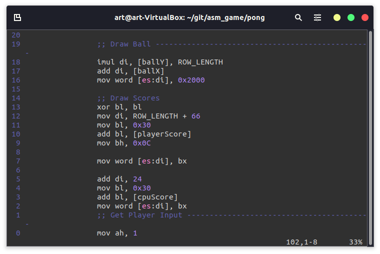

# PONG


This is my first asm game, I am using youtube tutorials to learn. The goal of this project is to get the basics of asm down. I am using x86 for asm. Here is what I have learned, this game is created in the bootsector - (an area on all harddrives that the cpu checks for code to start OS.) The asm must end with 0x55aa to be seen as a bootable program. 


The boot sector on all drive starts at **0x7c00**. To create constansts you can use the *equ* key pharse which replaces the constants name with the value for example 

```
; CONSTANSTS =====================================
PLAYERX     equ 4
 
...

mov bx, [PLAYERX] 
mov bx, 4
```


To end the boot sector we have to put **0xaa55** which tell the CPU this code is a bootable drive. 

## Game Loop 


The game loop is made up in several section the first is to set up the text mode to place symbols on we use the follow code for this:


then the game loops start where we have the follow sections:

* draw the cpu player and ball
* logic - if the ball was hit if etc
* move player and cpu 
* Check key press if a certain key was press then move cpu or reset game

### Drawing the cpu player and ball


The x86 arthethicture comes with various interuptes the we use the key board interupt to keep listening for the following keys W, S, C, R. The interupt we called was 

```
mov ah, 1
int 0x16
jz move_cpu

cbw 
int 0x16

```


## Game Play

If the player or cpu score 3 points first then their win and a message appears to let the player know. Their is also a counter to hold the user score. If a player it the left or right screen then a point is awarded and the ball is reset on the loser's side.


